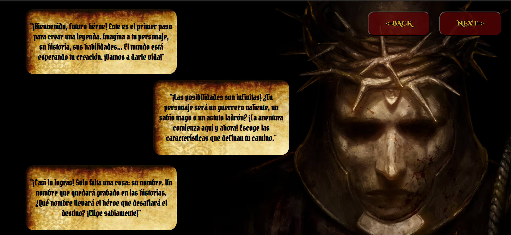
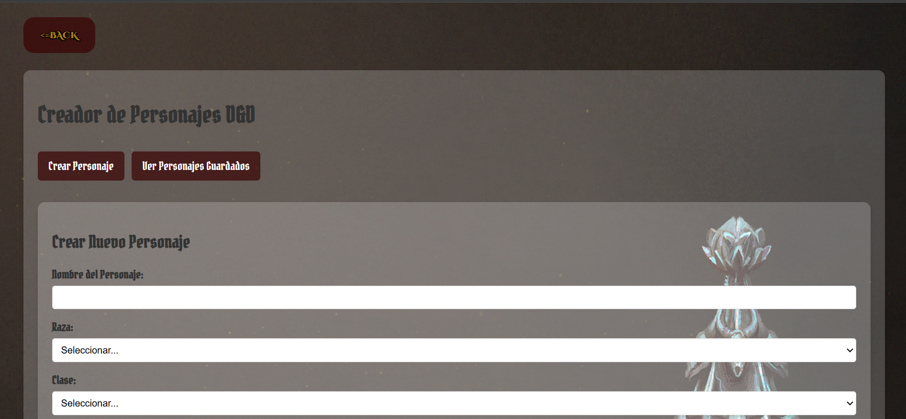
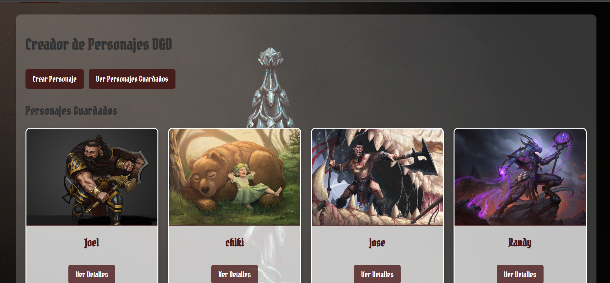
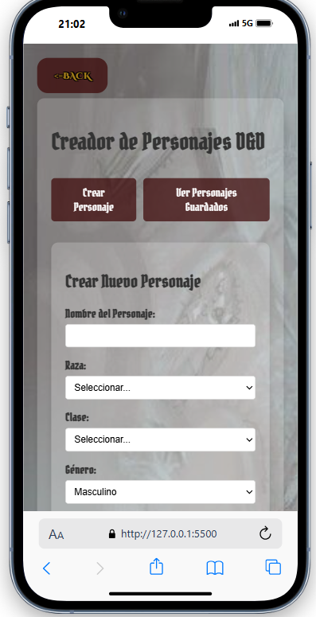

# 🐉 Dungeons & Dragons Character Creator

Este proyecto es una aplicación web interactiva para crear personajes de Dungeons & Dragons 5e. Permite al usuario seleccionar razas, clases, equipo e ilustraciones personalizadas, además de visualizar y administrar los personajes creados. Toda la información se guarda en `localStorage`, por lo que no requiere una base de datos externa.

## 👀 Un vistazo previo? ⬇️






## 📱 Tambien lo puedes ver en tu telefono u otro dispositivo con orientacion vertical ⬇️





Esto es solo un vistazo previo, puedes ver el programa clonando el repositorio y ejecutandolo o picando 

---

## ⚙️ Tecnologías utilizadas

- HTML, CSS y JavaScript puro (Vanilla JS)
- API pública de [D&D 5e](https://www.dnd5eapi.co/)
- Imágenes de ArtStation para la vista previa de los personajes guardados(enlaces en el código)
- LocalStorage para persistencia de datos

---

## 🚀 Cómo ejecutar el proyecto

1. Cloná o descargá este repositorio:
   ```bash
   git clone https://github.com/tu-usuario/dnd-character-creator.git

2. Abrí el archivo index.html en tu navegador:
- No se necesita instalar dependencias ni ejecutar servidores.
- El proyecto funciona completamente del lado del cliente.

3. ¡Listo! Ya podés empezar a crear tus personajes 🧙‍♂️🛡

(Tambien puedes hacerlo picando este link ➡️ [Link del programa](https://alejonm2402.github.io/Proyecto_JavaScriptNaranjoAlejandroTrigosDaniel/))


 ## 🔌 Configuración de la API
Esta aplicación utiliza la API pública de Dungeons & Dragons 5e, que no requiere autenticación. Sin embargo, asegurate de lo siguiente:

- Tener conexión a internet para poder cargar datos desde https://www.dnd5eapi.co.
- Si querés personalizar los endpoints o agregar filtros, podés revisar la documentación oficial de la API.
- Los datos de la API se usan para cargar razas, clases, habilidades, entre otros datos disponibles.


 ## Gracias por usar este programa y por interesarte al respecto
 
